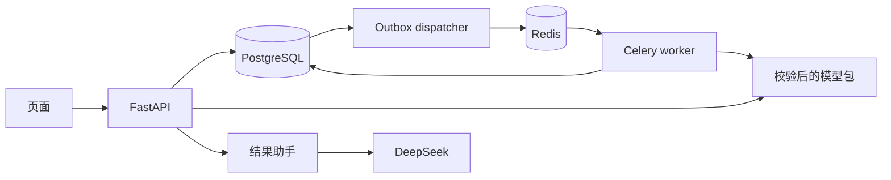

# 架构与代码阅读

这是一个应用的多个进程。FastAPI接收操作；PostgreSQL保存业务状态；Redis传递Celery消息；
dispatcher从outbox投递；worker执行训练并通过有效attempt登记结果。文件存在不等于交付成功。

## 任务与预测

从 [HTTP入口](../src/power_forecast_service/api/routes.py) 到 `experiments/service.py`，
看同事务登记任务/outbox；再看 `jobs/dispatcher.py`、`jobs/worker.py` 与 `experiments/execution.py`。
租约与attempt约束决定谁能完成任务，幂等请求不等于远端恰好执行一次。
模型包在 `storage/model_packages.py` 校验，在 `forecasting/predictor.py` 消费；
ENGIE原模型使用独立导入身份，禁止重新拟合后冒充原评分包。

## 助手

[api/assistant.py](../src/power_forecast_service/api/assistant.py) 管容量及HTTP状态；
[workflow.py](../src/power_forecast_service/assistant/workflow.py) 组织只读取证、模型调用、一次修复和审计；
[validation.py](../src/power_forecast_service/assistant/validation.py) 校验事实ID、引文、数字和阶段后渲染。
`evidence.py`从所选PG对象取指标并复核评分身份；`stages.py`区分开发选择、正式评价和采用决定；
`retrieval.py`提供默认关键词及可选固定embedding检索；`configuration.py`读取环境或运行目录中的密钥。

模型不接收SQL/命令执行权，不决定对象范围。至多两次模型请求，整体有时间预算；
未通过机器校验的回答不作为成功交付。校验不能证明自然语言的全部语义，因此保留人工语义复核。
助手故障不会停掉预测服务，前端切换对象/问题后旧答案失效。

## 修改与验证

`tests/unit`核对局部规则，`tests/integration`使用真实组件，`tests/e2e`跨HTTP/队列/worker验证。
真实PG测试创建自己的随机数据库并清理；历史原模型测试必须显式准备附件。
代码注释解释状态、事务和身份边界，测试入口见 [public-tests](public-tests.md)。
